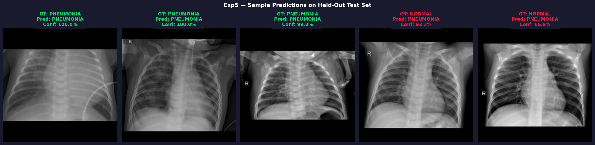
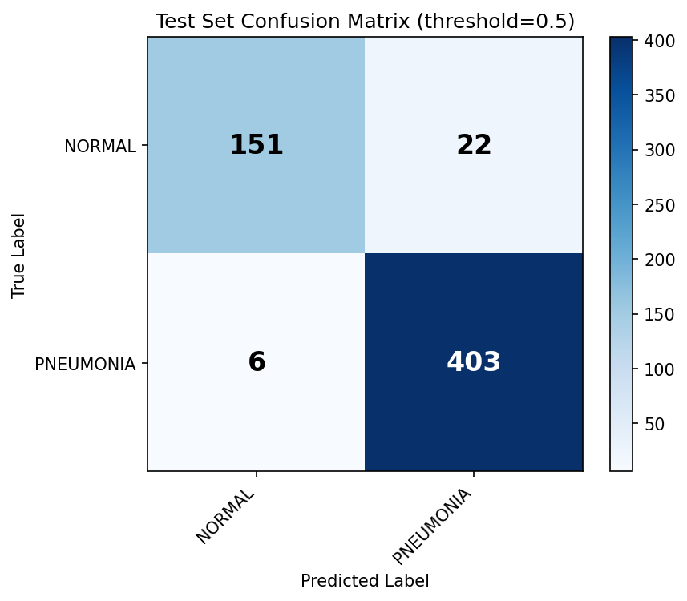

# Pneumonia Detection from Chest X-Rays

I built this project as part of my Master's coursework in Medical Image Classification. The goal was straightforward — can we train a CNN to reliably detect pneumonia from chest X-rays? The tricky part turned out to be not just the model itself, but everything around it: making sure the data split was actually clean, handling the fact that there are about 3× more pneumonia cases than normal ones, and figuring out why validation metrics kept spiking randomly during training.

After six experiments and a lot of debugging, the best model reaches **AUC-ROC of 0.9932** on validation and catches **98.5% of all pneumonia cases** on the held-out test set — with only 6 missed diagnoses out of 409.

---

## What's in this repo

```
medical_classifier/
├── src/
│   ├── model.py        # The CNN architecture
│   ├── dataset.py      # Data loading, augmentation, sampler
│   ├── train.py        # Training loop + W&B logging
│   └── evaluate.py     # Test set evaluation + visual outputs
├── configs/            # One YAML file per experiment (Exp1–Exp6)
├── scripts/            # Shell scripts to launch each training run
└── models/             # Saved metrics, confusion matrices, eval reports
```

Model weights are not committed here (they're too large for GitHub). They're available as W&B Artifacts — see the training dashboard link below.

---

## The Model

I kept the architecture intentionally simple. It's a custom CNN called `MedicalCNN` — four convolutional blocks followed by Global Average Pooling instead of a flat layer. GAP dramatically reduces the parameter count and forces the network to look at spatial patterns across the whole lung field rather than memorizing texture at specific pixel locations.

```
Input (224×224×3)
  → Conv Block ×4 (channels: 32 → 64 → 128 → 256)
  → Global Average Pooling
  → Linear(256→128) → Dropout(0.5)
  → Linear(128→1) → Sigmoid
```

Each conv block is `Conv2d → BatchNorm → ReLU → MaxPool2d`. Total params: ~1.2M, which trains fast and generalizes well without needing pretrained weights.

---

## Data Pipeline

The dataset is the [Kaggle Chest X-Ray Pneumonia dataset](https://www.kaggle.com/datasets/paultimothymooney/chest-xray-pneumonia) with 5,856 images from 3,189 unique patients.

**The leakage problem.** The original Kaggle split had patients appearing in both train and test. That's a serious problem — the model would be evaluated on people it had already "seen". I rebuilt the entire split at the patient level (80/10/10), ensuring no patient appears in more than one set.

**The imbalance problem.** The dataset has roughly 3× more pneumonia images than normal ones. I addressed this with two mechanisms working together: `WeightedRandomSampler` to balance batches during training, and `BCEWithLogitsLoss` with a `pos_weight=0.3598` to further correct the loss signal.

**Preprocessing.** All images are padded to square (preserving aspect ratio) then resized to 224×224. This prevents the distortion you get from naive resizing on rectangular X-rays.

---

## Experiments

I ran six experiments, each targeting a specific problem I observed in the previous run.

| Exp | Scheduler | Val AUC | Test Recall | Test F1 | Missed |
|-----|-----------|---------|-------------|---------|--------|
| 1 | ReduceLROnPlateau (baseline) | 0.9929 | 0.8900 | 0.9309 | 45 |
| 2 | ReduceLROnPlateau (fixed LR start) | 0.9903 | 0.8900 | 0.9309 | 45 |
| 3 | ReduceLROnPlateau (gentler factor) | 0.9920 | 0.9609 | 0.9656 | 16 |
| 4 | CosineAnnealingWarmRestarts | 0.9925 | 0.9951 | 0.9389 | 2 |
| **5** ⭐ | **CosineAnnealingLR** | **0.9932** | **0.9853** | **0.9664** | **6** |
| 6 | Linear Warmup + CosineAnnealingLR | 0.9927 | 0.9927 | 0.9323 | 3 |

**Why Exp5 wins.** Exp4 had only 2 missed cases but 51 false alarms — the warm restarts caused a catastrophic spike at epoch 70 when the LR jumped back up after the model had already converged. Exp5 uses a single smooth cosine decay from start to finish, no restarts, which gave the most balanced result across all metrics.

---

## Results (Exp5 — Test Set)



*Five predictions on held-out test images. Green title = correct prediction, red = incorrect. Confidence score shown below each label.*



*Test set confusion matrix. Out of 409 pneumonia cases, only 6 were missed.*

### Numbers at a glance

| Metric | Score |
|--------|-------|
| AUC-ROC | 0.9787 |
| F1-Score | 0.9664 |
| Recall (Sensitivity) | **98.53%** |
| Precision | 94.82% |
| Specificity | 87.28% |
| Accuracy | 95.19% |

In clinical terms: out of every 100 pneumonia patients, the model correctly identifies ~99. The remaining 1 might be missed, which is why a radiologist still reviews flagged cases — but this significantly reduces the manual screening burden.

---

## Setup

```bash
# 1. Clone
git clone https://github.com/Chere2016/pneumonia-chest-xray-classifier.git
cd pneumonia-chest-xray-classifier

# 2. Install dependencies
pip install torch torchvision scikit-learn wandb tqdm matplotlib pyyaml pillow

# 3. Download the dataset from Kaggle and place it in data/
#    https://www.kaggle.com/datasets/paultimothymooney/chest-xray-pneumonia

# 4. Preprocess (pad & resize to 224×224)
python scripts/preprocess_images.py

# 5. Build the patient-level split
python scripts/split_data.py
```

## Training

```bash
# Run Exp5 (best config)
chmod +x scripts/run_training_exp5.sh
./scripts/run_training_exp5.sh

# Watch live
tail -f logs/train_exp5.log
```

## Evaluation

```bash
python src/evaluate.py \
  --model models/medical_cnn_chest_xray_exp5_best_model.pth \
  --data_dir data_resized \
  --threshold 0.5 \
  --save_samples 5
```

---

## Training Dashboard

All 6 runs are logged with full metric curves on Weights & Biases:
[wandb.ai — medical-image-classifier](https://wandb.ai/u1999542-university-of-girona/medical-image-classifier)
